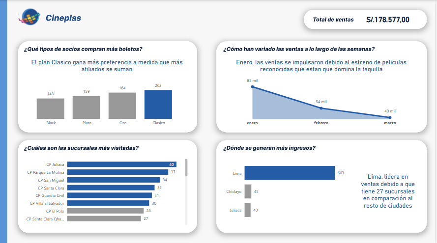

# 🚀 Portafolio de Proyectos Power BI

En esta parte mostrare los proyectos más relevantes que he desarrollado a lo largo de mi aprendizaje.

## 📌 Proyectos Destacados

### 1) 🎬 Cineplas

    Descripción:

    Es una cadena de cines con datos ficticios con el fin de realizar un análisis en el área de Ventas.

    Resultados:

    ✅ El plan clasico tuvo un incremento debido a nuevos afiliados.

    ✅ En Lima es donde se sigue generando más ingresos.

    ✅ Las ventas han bajado en los meses Febreo y Marzo, siendo Enero el mejor mes.

Captura de pantalla:

